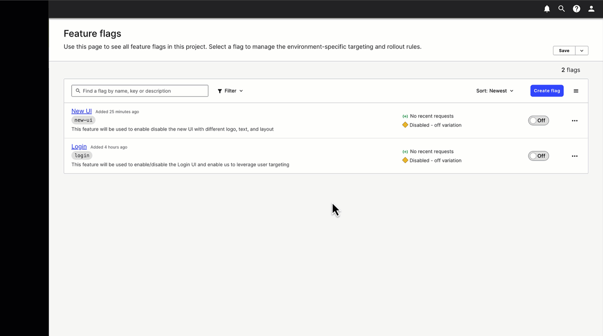

# Launching Darkly with a Vue (app)

This [Vue](https://vuejs.org/) application is designed to use several feature flags to showcase the ability to release features quickly using [LaunchDarkly](https://www.launchdarkly.com) and super power your Vue app. 

## Getting Started

### **Step 1**
Sign up for a [free trial of LaunchDarkly](https://app.launchdarkly.com/signup) to explore creating Feature Flags and targeting users with changes. It's fast, easy, and there's no obligation to continue.

### **Step 2**
Create the following feature flags within LaunchDarkly

* `login`
  - Create this flag as a `boolean` flag 
  - This feature flag will be used to enable the login UI that can be used to leverage targeting based on a user ID. 
  

Click here to see how

  	
    
  

* `new-ui`
  - Create this flag as a `boolean` flag
  - This feature flag changes the view of the application out of the Osmo logo, introducing a new banner, image, and text.
    

Click here to see how

  	
    
  

### **Step 3**
Get your LaunchDarkly Client-Side ID from the [LaunchDarkly console](https://app.launchdarkly.com/)

- :hand: Manual way 
  - You can find the Client-Side ID under `Account Settings > Projects > <Your Project Name>`
  - Click your project name
  - Click the `Client-side ID` for the key you want
- :sunglasses:  Super cool way 
  -  `CMD+K` or `CTRL+K`, typing "copy" and selecting `Copy SDK key for the current environment` and selecting **"Client-side ID"** from the list. 

  

Click here to see how

  	
   
  

This will add it to your clipboard for easy copy and paste. 

### **Step 4**
Create a secret in Replit (the lock screen on the left side of your editor) where the key is  
`VITE_LD_CLIENT_ID` and the value is your **Client-side ID**  
(it's in your clipboard if you did this the cool way :wink: or if you clicked the ID in the LaunchDarkly console)

**:warning: Potential gotcha**: make sure you got the **"Client-side ID"** from the LaunchDarkly console and not one of the other keys! 

## :champagne: Let's pop some flags :champagne:

:rocket: If you've set everything up, you should be ready to roll! :rocket:

From here, we can enable our new feature and observe how our application changes based on a new feature being rolled out. 

* `login`
  - Enable this feature first.
  - Your UI should update to include a login screen.
  - We can use this login screen to configure `Targeting Rules` within LaunchDarkly to target feature releases at specific users. 
* `new-ui`
  - Create a `targeting rule` for your user, for this feature flag.
  - Ensure you set the `Default Rule` to false to ensure that only users who are targeted receive feature changes.